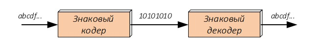
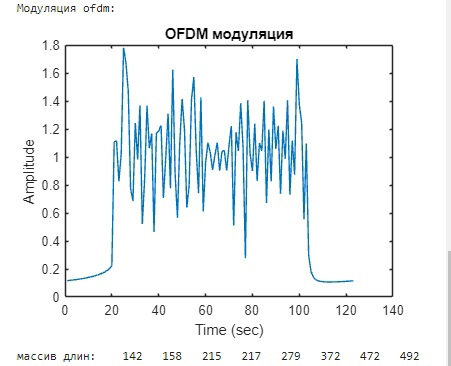

# Имитационная модель канала связи OFDM в Matlab

## Lab1  Знаковое кодирование

Задание: Реализовать знаковое кодирование и декодирование текстового сообщения

Используемый алфавит:

- a = [1,0,0,0,0,1,1]
- v = [0,1,1,0,1,1,1]
- k = [1,1,0,1,0,1,1]
- l = [0,0,1,1,0,1,1]
- o = [1,1,1,1,0,1,1]
- u = [1,0,1,0,1,1,1]

Пример работы: 

## Lab2  Помехоустойчивое кодирование

Задание: Реализовать операцию сверточного кодирования и витерби декодирования битового сообщения

Пример работы: 

## Lab3  Перемежение

Задание: Реализовать операцию прямого и обратного перемежения закодированного битового сообщения

Вектор перемежения генерируется с помощью функции в Matlab:

ran_index = randperm(length(conv_massage));

Пример работы:

## Рефакторинг 

код переработан в лайф скрипт, каждая функция в отдельном файле

## Lab4 QPSK Модуляция

Задание: Реализовать операцию QPSK-модуляции битового сообщения и QPSK-демодуляции символов модуляции

Пример работы:

## Lab5 OFDM модуляция

Задание: Реализовать формирование OFDM-символа, включающего в себя QPSK-символы и опорные сигналы

Пример работы:

